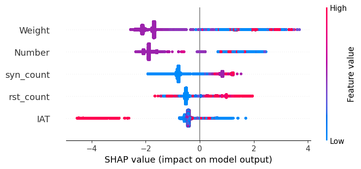

# Классификатор Recon-атак в IoT-сетях

## Описание задачи

Данный проект представляет собой итоговое задание по курсу "**Безопасность инфраструктурных технологий**" (весна 2025). Он выполнен студентами группы 535 — *Копыловой Екатериной* и *Милиенковым Антоном*. Цель работы – разработать систему машинного обучения, способную обнаруживать атаки типа **Recon (разведка)** в сетевом трафике Интернета вещей (IoT).

В рамках проекта реализованы следующие этапы:

* **Построение модели классификации:** обучена ML-модель, различающая Recon-атаки от всего остального трафика.
* **Интерпретация модели с помощью SHAP:** проанализированы вклад и значимость признаков в решения модели с использованием SHAP (Shapley Additive Explanations).
* **Контрфактический анализ:** сформированы примеры с минимальными изменениями, показывающие, как можно **изменить свойства атак**, чтобы модель перестала распознавать их (то есть демонстрация потенциальной эвристики обхода модели).

Проект выполнен в формате Jupyter Notebook с подробными комментариями, благодаря чему все этапы легко воспроизвести.

## Используемые данные и предобработка

Для обучения использованы открытые данные из набора **IoT Intrusion Dataset** с платформы Kaggle (сетевой трафик IoT с метками атак) . В датасете представлено порядка **1 млн** сетевых сессий, каждая описана \~47 характеристиками.

**Формирование целевого признака:** исходные метки, содержащие подстроку *"Recon"*, были выделены и объединены в один положительный класс (атака Recon). Всем остальным сессиям (обычный трафик и атаки других типов) присвоен отрицательный класс. Таким образом, задача сведена к бинарной классификации: *«Recon-атака или нет»*.

**Очистка данных:** в данных отсутствовали пропуски (NaN). Были удалены неинформативные признаки:

* Постоянные столбцы (не несущие вариативности) исключены.
* Текстовые поля (например, идентификаторы устройств или IP-адреса) также удалены, так как модель обучалась только на числовых признаках.

После очистки все признаки представляли собой числовые показатели сетевого трафика (например, длительность соединения, размеры и скорость пакетов, флагы протоколов и др.). Датасет разбит на обучающую и тестовую выборки в соотношении **80/20**.

**Дисбаланс классов:** Разведывательные атаки составляют лишь небольшую долю от всех наблюдений, что создает сильный перекос классов. Это означает, что модель могла бы тривиально давать ответ "не атака" и получать высокую общую точность. Чтобы этого избежать, при обучении мы учли дисбаланс с помощью специальных методов (см. ниже).

## Построение модели

Для классификации выбран алгоритм **CatBoostClassifier**. Данная модель хорошо подходит для наших целей, так как:

* **Эффективна на табличных данных:** учитывает нелинейные зависимости и взаимодействия признаков, характерные для сетевого трафика.
* **Устойчива к дисбалансу:** мы задействовали параметр `auto_class_weights='Balanced'`, благодаря чему CatBoost автоматически настроил веса классов пропорционально их частоте. Это повышает чувствительность к редкому классу (Recon) без необходимости ручной балансировки.
* **Быстро обучается:** CatBoost оптимизирован для больших выборок и предоставляет встроенную поддержку GPU (при необходимости), что актуально при \~1 млн объектов.

Обучение проводилось на тренировочной выборке (≈80% данных). В качестве основной метрики оптимизации выбрана **F1-мера для класса Recon**, поскольку она учитывает как полноту обнаружения атак (recall), так и точность срабатываний (precision). Была проведена настройка количества итераций бустинга (установлено 1000 деревьев) и других гиперпараметров по умолчанию. Модель обучена при фиксированном `random_state=42` для воспроизводимости.

## Метрики качества модели

Модель оценивалась на отложенной тестовой выборке (≈20% данных). Результаты оказались следующими:

* **Общая точность** классификации \~**98%**, а **сбалансированная точность** (Balanced Accuracy) \~**0.99**. Высокое значение сбалансированной точности говорит о хорошем качестве распознавания как атак, так и нормального трафика, несмотря на дисбаланс.

* **Полнота (Recall) для Recon-атак** достигла **1.00 (100%)** при стандартном пороге решения 0.5. То есть модель обнаружила **все** разведывательные атаки в тестовых данных – ни одна атака не была пропущена. Это крайне важный результат с точки зрения безопасности, так как минимизирует ложно-негативные ошибки (пропущенные атаки).

* **Точность (Precision) для Recon-атак** при этом оказалась довольно низкой – всего **0.27 (27%)**. Иными словами, из всех случаев, которые модель пометила как "Recon-атака", лишь около четверти действительно были разведкой, а остальные оказались ложными тревогами. Значение **F1-score** для класса Recon на пороге 0.5 составило порядка **0.43**, что умеренно, учитывая экстремальный дисбаланс.

Такой расклад свидетельствует о консервативном поведении модели: она **"ошибается в сторону подозрения"**, выдавая много ложных срабатываний, но благодаря этому достигается идеальный охват атак. В контексте IDS (Intrusion Detection System) это приемлемо, если ключевая задача – не пропустить ни одной атаки. Однако на практике слишком большое число ложных тревог может быть нежелательным, создавая дополнительную нагрузку на аналитиков.

Чтобы улучшить баланс precision/recall, мы провели **оптимизацию порога классификации**. Путем анализа кривой Precision-Recall был выбран более высокий порог вероятности, при котором F1-мера максимизируется. Этот шаг позволил **уменьшить число ложных срабатываний** ценой небольшого снижения полноты. После корректировки порога:

* Precision (Recon) повысился до \~**0.32** (т.е. доля истинных атак среди срабатываний выросла до 32%).
* Recall (Recon) при этом снизился до \~**0.76** (модель стала пропускать около 24% разведывательных атак).
* F1-score (Recon) незначительно увеличился до **0.45**.

Для наглядности сравнение метрик до и после пороговой оптимизации:

| Метрика (класс Recon) | Порог 0.5 | Оптимальный порог |
| --------------------- | --------- | ----------------- |
| Recall (полнота)      | **1.00**  | **0.76**          |
| Precision (точность)  | **0.27**  | **0.32**          |
| F1-score              | 0.43      | 0.45              |
| Balanced Accuracy     | 0.99      | 0.98              |

Как видно, компромиссным порогом удалось немного повысить точность определения атак и итоговую F1, при этом модель по-прежнему ловит большинство (≈76%) Recon-атак. Выбор рабочего порога зависит от прикладных требований: если критично не пропустить ни одной атаки — лучше оставить порог низким, если же важнее сократить ложные тревоги — стоит поднять порог для повышения precision.

## Объяснение модели (с использованием SHAP)

Чтобы понять, **на каких признаках основаны решения модели**, мы применили метод интерпретации SHAP. Для обученного CatBoost-классификатора вычислены значения SHAP Value для каждого признака как в глобальном масштабе, так и для отдельных предсказаний.

Визуальный анализ summary-графиков SHAP позволил выявить ключевые факторы, влияющие на классификацию Recon-атак. Ниже перечислены **топ-5 наиболее значимых признаков** и их интерпретация:

1. **IAT (Inter Arrival Time, интервал между пакетами):** при **низких значениях** этого признака (то есть когда пакеты идут очень часто) модель склонна относить трафик к Recon-атаке. Логика в том, что сканирование (разведка) обычно генерирует множество коротких пакетов с минимальными промежутками, в попытке быстро перебрать порты или устройства.

2. **Weight:**  показатель нагрузки, присутствующий в датасете. Модель выявила, что **высокое значение Weight** напрямую ассоциируется с атакующим поведением. Вероятно, этот признак комбинирует сразу несколько аспектов трафика (например, произведение числа входящих и исходящих пакетов) и при больших величинах указывает на аномально интенсивные сеансы, характерные для некоторых атак.

3. **syn\_count (число SYN-флагов):** малое количество SYN-флагов в соединении характерно для Recon-сканирования. Если за сессию отправлено очень мало пакетов с SYN (началом TCP рукопожатия), это усиливает подозрение на разведку. Модель учитывает этот сигнал: отсутствие полноценного установления соединений (например, только одиночные SYN-пакеты) смещает предсказание в сторону класса атаки.

4. **Number (общее количество пакетов):** модель обращает внимание на общий размер сессии в пакетах. **Чем меньше пакетов** содержит поток, тем выше вероятность, что это разведывательная активность. Recon-атаки зачастую состоят из коротких сессий (например, один запрос – один ответ), тогда как легитимный трафик или другие типы атак (DDoS, обмен данными) обычно формируют более длительные сессии.

5. **rst\_count (число RST-флагов):** отсутствие пакетов с флагом *RST* (сброс соединения) тоже служит индикатором Recon. При быстром сканировании атакующий хост не тратит время на корректное закрытие соединений, либо сканируемые узлы не успевают отправить RST прежде, чем сканер перейдет к следующей цели. Модель усвоила, что нулевой `rst_count` чаще соответствует разведке, тогда как в нормальных коммуникациях и некоторых атаках присутствуют сбросы соединений.

Эти признаки интуитивно согласуются с природой разведывательных атак: **короткие, быстрые соединения без полноценного установления и завершения сессии**. Высокие значения SHAP для перечисленных атрибутов означают, что модель опирается на них при вынесении решений о том, является ли трафик разведкой.

## Контрфактический анализ

На заключительном этапе мы исследовали устойчивость модели и **смоделировали способы обхода** детектирования. Используя результаты SHAP, были сформулированы изменения к ключевым признакам, способные **"скрыть" Recon-атаку от модели**. Задача состояла в том, чтобы внести минимальные правки в данные атаки, после которых модель ошибочно классифицирует её как безвредный трафик. Такие модифицированные примеры называют **контрфактическими**.

Опираясь на топ-5 важных признаков, мы применили следующие трансформации к ряду сессий Recon в тестовой выборке:

| Признак        | Модификация                        | Причина                                           |
| -------------- | ---------------------------------- | ------------------------------------------------- |
| **Weight**     | уменьшение на \~30%  (×0.7)        | Маскируем объём трафика (снижаем нагрузку)        |
| **Number**     | уменьшение на \~30%  (×0.7)        | Уменьшаем общее число пакетов в сессии            |
| **syn\_count** | установить в 0  (→0)               | Удаляем признак сканирования (нет SYN-пакетов)    |
| **rst\_count** | установить в 0  (→0)               | Исключаем сбросы соединения (нет RST-флагов)      |
| **IAT**        | увеличение интервала пакетов (≈×2) | Сглаживаем интервалы (замедляем отправку пакетов) |

Эти изменения направлены на **уменьшение заметности ключевых признаков**, при этом основная структура трафика остается похожей на изначальную атаку. Проще говоря, мы попытались сделать атаку более похожей на нормальный либо на другой (не Recon) тип поведения, не внося радикальных искажений.

Далее мы прогнали через модель 1000 таких **контрфактических примеров**, изначально принадлежавших классу Recon, чтобы проверить, сколько из них сумеют "проскочить". Результат показал, что около **59%** модифицированных атак **не были распознаны** моделью как Recon. Иными словами, в \~59% случаев классификатор ошибочно отнес измененную атаку к безобидному трафику (негативному классу). Это довольно высокая успешность для попытки обхода.

Анализ метрик на смешанной выборке (включавшей как оригинальные, так и модифицированные атаки) подтвердил падение эффективности: полнота обнаружения Recon снизилась с 100% до \~76%. Этот эксперимент демонстрирует **уязвимость модели**: зная, какие признаки наиболее важны, злоумышленник теоретически может откорректировать свое поведение (например, замедлить скорость сканирования, разрывать соединения и т.д.), чтобы снизить вероятность детектирования.

Таким образом, контрфактический анализ послужил своего рода *атакой на модель*, выявив ее слабые места. В то же время, с точки зрения защиты, он помогает понять, в каких ситуациях классификатор может дать сбой. Такие знания позволяют в дальнейшем улучшить систему обнаружения (например, добавить правила для отлова более медленных сканирований или включить дополнительные признаки, учитывающие контекст).

## Выводы

В ходе проекта успешно разработан и исследован классификатор для выявления Recon-атак в сетевом трафике IoT. Модель показала высокую чувствительность – способна обнаруживать все разведывательные атаки – однако поддержание высокого recall сопровождается падением precision, что потребовало дополнительной настройки порога для более сбалансированной работы. Анализ качества подтвердил, что задача детектирования именно Recon-паттернов среди разнообразного трафика достаточно сложна: признаки разведки могут пересекаться с другими случаями, вызывая ложные срабатывания.

Применение **SHAP** существенно помогло интерпретировать поведение модели. Выявлены осмысленные ключевые признаки (очень короткие и частые соединения, отсутствие завершения сессии и т.п.), по которым модель распознает разведку. Это придает доверия результатам классификации и указывает направления для дальнейшего улучшения моделей IDS. Кроме того, было проведено построение **контрфактических примеров**, показавшее, как злоумышленник может обмануть модель, скорректировав характеристики атаки. 
